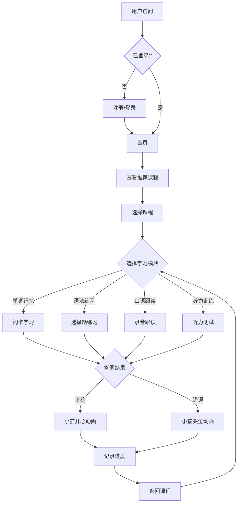

## 1. Product Overview
一款专为中国留马医学生打造的马来语学习平台，支持移动端使用。提供沉浸式语言学习体验，涵盖医学专业词汇（护理、中医）和日常生活场景。

- **目标用户**: 中国在马来西亚留学的医学生（护理专业、中医专业）
- **核心价值**: 通过可爱的海滩小猫甜品风格，打造轻松有趣的语言学习体验，帮助用户快速掌握专业和日常马来语

## 2. Core Features

### 2.1 User Roles
| Role | Registration Method | Core Permissions |
|------|---------------------|------------------|
| Normal User | Email/Phone registration | Access all learning features, track progress |

### 2.2 Feature Module
1. **首页**: 学习进度概览、推荐课程、每日打卡
2. **课程页面**: 分级课程体系、课程列表、课程详情
3. **学习模块**: 单词记忆、语法练习、口语跟读、听力训练
4. **个人中心**: 用户信息、学习统计、设置

### 2.3 Page Details
| Page Name | Module Name | Feature description |
|-----------|-------------|---------------------|
| 首页 | 进度概览 | 显示总学习时长、完成课程数、连续打卡天数 |
| 首页 | 推荐课程 | 根据学习路径推荐个性化课程 |
| 首页 | 每日打卡 | 每日学习任务完成后打卡获得奖励 |
| 课程页面 | 课程列表 | 按级别展示课程（初级/中级/高级） |
| 课程页面 | 课程分类 | 医学专业、日常生活等分类 |
| 学习模块 | 单词记忆 | 闪卡式单词学习，支持发音和例句 |
| 学习模块 | 语法练习 | 选择题形式的语法练习 |
| 学习模块 | 口语跟读 | 录音对比，发音评分 |
| 学习模块 | 听力训练 | 听力材料播放，理解题作答 |
| 个人中心 | 学习统计 | 详细的学习数据分析图表 |
| 个人中心 | 用户设置 | 修改密码、语言偏好等 |

## 3. Core Process

用户注册/登录 → 首页查看推荐课程 → 选择课程开始学习 → 完成学习模块 → 获得小猫动画反馈 → 查看学习进度

## 4. User Interface Design

### 4.1 Design Style
- **主色调**: 粉色、浅蓝色（海滩甜品风格）
- **辅助色**: 奶油白、橙色、黄色
- **按钮风格**: 圆角、可爱、带有小猫元素
- **字体**: 圆润可爱的无衬线字体
- **布局**: 卡片式布局，温馨舒适
- **动画**: 答对显示小猫开心动画，答错显示小猫哭泣动画

### 4.2 Page Design Overview
| Page Name | Module Name | UI Elements |
|-----------|-------------|-------------|
| 首页 | 背景 | 海滩甜品背景，可爱小猫元素 |
| 首页 | 进度卡片 | 圆形进度条，粉色主题 |
| 首页 | 课程卡片 | 圆角卡片，带有小猫图标 |
| 学习模块 | 题目区域 | 白色圆角背景，柔和阴影 |
| 学习模块 | 反馈区域 | 小猫动画展示区 |
| 个人中心 | 统计图表 | 彩色柱状图/折线图 |

### 4.3 Responsiveness
- **移动端优先**: 专为手机设计，触控优化
- **响应式布局**: 适配不同屏幕尺寸
- **触控友好**: 大按钮设计，便于手指点击

### 4.4 动画设计
- **答对动画**: 小猫跳起来吃甜品，周围有星星特效
- **答错动画**: 小猫低头哭泣，周围有水滴特效
- **页面切换**: 平滑过渡动画
- **进度更新**: 进度条动画效果
