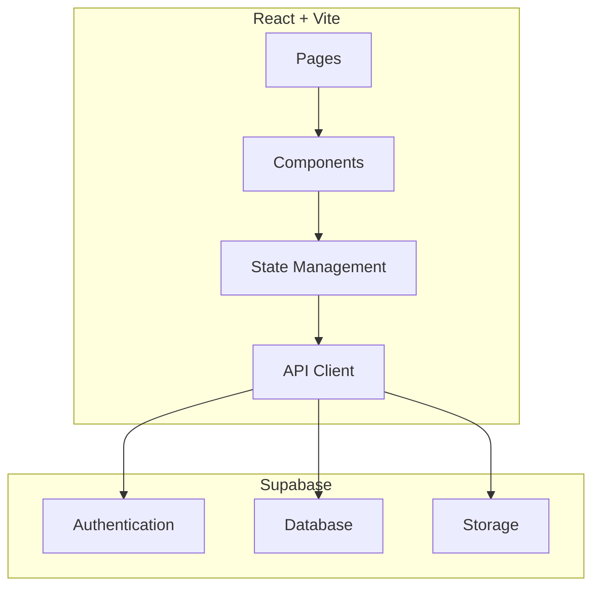
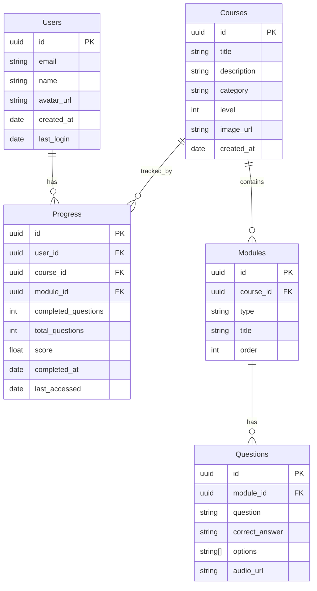

## 1. Architecture Design



## 2. Technology Description
- **Frontend**: React@18 + TypeScript + TailwindCSS@3 + Vite
- **State Management**: Zustand
- **Routing**: React Router DOM
- **Backend**: Supabase (Authentication, Database, Storage)
- **Icons**: Lucide React

## 3. Route Definitions
| Route | Purpose |
|-------|---------|
| / | 首页 |
| /login | 登录页面 |
| /register | 注册页面 |
| /courses | 课程列表页面 |
| /courses/:id | 课程详情页面 |
| /learn/:courseId/:moduleType | 学习模块页面 |
| /profile | 个人中心页面 |

## 4. API Definitions

### 4.1 Authentication
| Method | Endpoint | Description |
|--------|----------|-------------|
| POST | /auth/signup | 用户注册 |
| POST | /auth/signin | 用户登录 |
| POST | /auth/signout | 用户登出 |
| GET | /auth/user | 获取当前用户 |

### 4.2 Courses
| Method | Endpoint | Description |
|--------|----------|-------------|
| GET | /courses | 获取课程列表 |
| GET | /courses/:id | 获取课程详情 |

### 4.3 Progress
| Method | Endpoint | Description |
|--------|----------|-------------|
| GET | /progress | 获取用户学习进度 |
| POST | /progress | 更新学习进度 |
| GET | /progress/stats | 获取学习统计数据 |

## 5. Data Model

### 5.1 Data Model Definition



### 5.2 Data Definition Language

```sql
CREATE TABLE users (
    id UUID PRIMARY KEY DEFAULT uuid_generate_v4(),
    email VARCHAR(255) UNIQUE NOT NULL,
    name VARCHAR(255) NOT NULL,
    avatar_url VARCHAR(500),
    created_at TIMESTAMP DEFAULT NOW(),
    last_login TIMESTAMP
);

CREATE TABLE courses (
    id UUID PRIMARY KEY DEFAULT uuid_generate_v4(),
    title VARCHAR(255) NOT NULL,
    description TEXT,
    category VARCHAR(100) NOT NULL,
    level INT NOT NULL,
    image_url VARCHAR(500),
    created_at TIMESTAMP DEFAULT NOW()
);

CREATE TABLE modules (
    id UUID PRIMARY KEY DEFAULT uuid_generate_v4(),
    course_id UUID REFERENCES courses(id),
    type VARCHAR(50) NOT NULL,
    title VARCHAR(255) NOT NULL,
    order INT NOT NULL
);

CREATE TABLE questions (
    id UUID PRIMARY KEY DEFAULT uuid_generate_v4(),
    module_id UUID REFERENCES modules(id),
    question TEXT NOT NULL,
    correct_answer VARCHAR(500) NOT NULL,
    options TEXT[] NOT NULL,
    audio_url VARCHAR(500)
);

CREATE TABLE progress (
    id UUID PRIMARY KEY DEFAULT uuid_generate_v4(),
    user_id UUID REFERENCES users(id),
    course_id UUID REFERENCES courses(id),
    module_id UUID REFERENCES modules(id),
    completed_questions INT DEFAULT 0,
    total_questions INT DEFAULT 0,
    score FLOAT DEFAULT 0,
    completed_at TIMESTAMP,
    last_accessed TIMESTAMP DEFAULT NOW()
);

GRANT SELECT ON courses TO anon;
GRANT SELECT ON modules TO anon;
GRANT SELECT ON questions TO anon;

GRANT ALL PRIVILEGES ON users TO authenticated;
GRANT ALL PRIVILEGES ON progress TO authenticated;
```

## 6. Project Structure

```
src/
├── components/
│   ├── common/
│   │   ├── Button.tsx
│   │   ├── Card.tsx
│   │   └── CatAnimation.tsx
│   ├── layout/
│   │   ├── Header.tsx
│   │   └── Footer.tsx
│   └── modules/
│       ├── FlashCard.tsx
│       ├── GrammarQuiz.tsx
│       ├── SpeakingPractice.tsx
│       └── ListeningExercise.tsx
├── pages/
│   ├── Home.tsx
│   ├── Login.tsx
│   ├── Register.tsx
│   ├── Courses.tsx
│   ├── CourseDetail.tsx
│   ├── Learn.tsx
│   └── Profile.tsx
├── hooks/
│   ├── useAuth.ts
│   ├── useProgress.ts
│   └── useCourses.ts
├── store/
│   └── appStore.ts
├── utils/
│   └── supabase.ts
├── types/
│   └── index.ts
└── App.ts